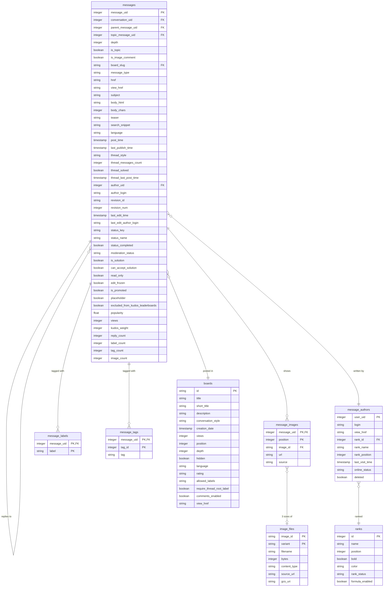

# Mozilla Connect (Khoros) API

[Mozilla Connect](https://connect.mozilla.org) runs on Khoros Communities. This
page documents its API as we actually found it, so we can pull Connect content
into BigQuery.

To pull the data, see [Running the export](#running-the-export) — one command.
There is also a Fivetran connector, currently paused; [Two ways to
export](#two-ways-to-export) compares them.

Khoros is SaaS, so there is no database schema to read. What we have is the
**LiQL collection model** — the API's view of the data. Everything below was
probed against the live instance anonymously on 2026-08-12, so it reflects what
we can actually reach, not just what Khoros documents.

Endpoint: `GET https://connect.mozilla.org/api/2.0/search?q=<LiQL>`
No credentials needed for public content, post bodies included.

## Running the export

One command:

```
uv run scripts/connect_export.py refresh
```

That clears the old data, fetches everything, and loads it into BigQuery and the
GCS bucket. **About three hours**, nearly all of it labels and tags — those need
one request per message and there are roughly 13,000 of them.

It checks Khoros, BigQuery and the bucket first, so a stale `gcloud` token or a
typo fails in seconds rather than after three hours.

If a step fails, everything up to it is saved. Carry on with:

```
uv run scripts/connect_export.py refresh --resume
```

Without `--resume` it starts over, throwing that progress away. The failure
message says this too.

Output goes to `~/connect-export` (about 2.5 GB) unless you pass `--out`.
Individual steps — `fetch-messages`, `fetch-labels`, `fetch-images`, `load`,
`clean` and so on — are there for redoing one part; run `--help` for the list.

⚠️ **If you run the steps by hand, clean first.** Each fetch step skips whatever
it already has, so without a clean the run finishes in seconds, reports success,
and picks up nothing new. There is no warning. `refresh` does the clean for you,
which is the main reason to prefer it.

## Two ways to export

**Use `scripts/connect_export.py`.** The Fivetran connector alongside it works and
was checked table by table against the script, but it is **paused and was never
deployed** — see [why](#why-the-connector-is-paused) below. It is kept in case
the blockers clear.

| | `scripts/connect_export.py` | `fivetran/khoros/connector.py` |
|---|---|---|
| Status | **in use** | paused, never deployed |
| Runs | by hand, when you ask | would run on a Fivetran schedule |
| Lands in | `mozilla_connect_content` + a GCS bucket, both ours | the Fivetran destination, in a schema named on the connection |
| Deletions | row disappears, because each load replaces the table | row stays, flagged `_fivetran_deleted` |
| Partitioning | month on `post_time`, clustered on the join keys | Fivetran owns the DDL |
| Image sizes | recorded in bytes | not recorded (see below) |
| Local copy | ~2.5 GB on disk | nothing kept |

Both read the same API, produce the same rows, and have been checked against
each other table by table. Neither is incremental: Khoros cannot answer "what
changed since Tuesday", so every run is a full re-sweep.

### Why the connector is paused

Two reasons, and the second is the one that mattered.

**It needs account changes we don't control.** Two of them:

1. **Unstructured file replication, enabled on the Fivetran account.** Without
   it the SDK refuses every upload with "File uploads are not enabled for this
   connector". Locally you can set `CONNECTOR_SDK_SUPPORT_UNSTRUCTURED_DATA=true`
   to test, which is how we verified the image path works, but production needs
   it switched on properly.
2. **A GCS bucket set on the BigQuery destination**, in the same location as the
   dataset. That destination is shared with other connections, including the one
   feeding `mozilla_connect`, so it isn't ours to change.
   `gs://sumo-prod-prod-connect-images` was moved from US-WEST1 to US
   multi-region to satisfy the location rule — the dataset is US, and a
   single-region bucket would not have qualified.

**Scheduling buys less than it looks.** Khoros cannot answer "what changed since
Tuesday", so every sync re-sweeps all 93,000 messages regardless. A scheduled
connector would spend three hours doing that on a timer instead of when someone
wants it, which is most of the appeal gone.

The connector is worth keeping — it works, and it took real effort to establish
what the API will and won't do. If the account side ever clears, it is ready.

### Where they genuinely differ

**Deletions.** Both handle them, differently.

The script loads with `bq load --replace`, so each table is rewritten from
scratch. A post deleted on Connect is simply absent afterwards — a hard delete,
for free, with nothing to remember.

The connector cannot do that, because it sends rows one at a time rather than
replacing a table. Instead it calls `truncate()` at the start of a fresh sweep,
which marks every existing row `_fivetran_deleted = TRUE`; the upserts that
follow clear the flag on everything still present, leaving the flag set on
whatever the source dropped. A soft delete, so those rows stay in the table and
queries need `WHERE NOT _fivetran_deleted`.

For most purposes the script's behaviour is the more convenient of the two. The
connector's is more informative, since a flagged row is a record that the post
once existed.

**Image file sizes.** Khoros sends no `Content-Length` on image responses. The
script reports sizes only because it downloads each file into memory and
measures it. The connector streams straight through to Fivetran, so it never
sees a total and has no `bytes` column at all.

**Image paths.** The script writes `<variant>/<filename>` into a bucket it
controls. The connector hands Fivetran the same relative path, which lands under
`<schema>/image_files/<variant>/<filename>`. Read `_fivetran_file_path` rather
than assuming either layout.

## What lands in BigQuery

Eight tables in `moz-fx-sumo-prod.mozilla_connect_content`, plus the image files
in `gs://sumo-prod-prod-connect-images`.



`messages` is the centre of it. Everything else either describes a message, or
describes something a message points at.

Every column is listed above with the type BigQuery gives it. The sections below
say what each one means.

### messages — one row per post, 92,385 of them

**Where it sits in the thread**

| Column | Meaning |
|---|---|
| `message_uid` | The post's own ID. Primary key. |
| `conversation_uid` | The thread's ID, which is the opening post's `message_uid`. |
| `parent_message_uid` | The post being replied to. Null on thread openers. |
| `topic_message_uid` | **Always identical to `conversation_uid`** — 0 differences across all 92,385 rows. Kept only because Khoros returns both. |
| `depth` | 0 for a thread opener, higher for replies. Null on ~782 rows (see the count discrepancy above). |
| `is_topic` | True for thread openers. Equals `depth = 0` in every row. |
| `board_slug` | Joins to `boards.id`. |
| `message_type` | `forum_topic_message`, `idea_topic_message`, `forum_reply_message`, and so on. |
| `is_image_comment` | Always null. Kept as a signal: if it ever fills in, those 782 unreachable messages became reachable. |

Threading is genuinely nested, not flat: 62,060 replies point at the thread
root, but **11,371 point at another reply**. So to rebuild a conversation, follow
`parent_message_uid`, not `conversation_uid`.

**What was written**

| Column | Meaning |
|---|---|
| `subject` | The post title. |
| `body_html` | The post itself, as HTML. This is the thing the whole export exists for. |
| `body_chars` | Length of `body_html`. |
| `search_snippet` | A plain-text extract Khoros builds. Not simply the first N characters — 17,049 rows are not a prefix of the body — so it is useful if you want text without parsing HTML. |
| `teaser` | Always empty on Connect. |
| `language` | Always `EN`. |
| `href`, `view_href` | The API path and the real public URL of the post. |

**When**

`post_time` · `last_publish_time` · `last_edit_time` (from the current revision)

**Who**

`author_uid` joins to `message_authors.user_uid`. `author_login` is denormalised
onto the row so simple queries need no join. `revision_id`, `revision_num` and
`last_edit_author_login` describe the most recent edit.

**Ideas workflow** — null on forum posts

`status_key` (`new`) · `status_name` (`New idea`, `Delivered`) ·
`status_completed`. Ideas is the largest board, so this is how you find which
requests shipped.

**How it did**

| Column | Meaning |
|---|---|
| `views` | View count. |
| `kudos_weight` | Total kudos. On the Ideas board a kudo is a **vote**, so this is the vote count. |
| `popularity` | Khoros's own decaying score. Frequently negative; not a percentage of anything. |
| `thread_messages_count`, `thread_solved`, `thread_last_post_time`, `thread_style` | Facts about the whole thread, repeated on every post in it. |
| `reply_count` | Direct replies to this post. |

**Counts that drive the export**

`label_count`, `tag_count`, `image_count` come free with each message and are
what let the export skip messages with nothing to fetch. They are also the check
that caught a real bug: the totals in `message_labels` and `message_tags` must
match `SUM(label_count)` and `SUM(tag_count)`, and one mismatch revealed that
Khoros silently truncates at 25 rows.

**Flags that never vary** — all `false` on every row today

`can_accept_solution` · `edit_frozen` · `is_promoted` · `placeholder` ·
`excluded_from_kudos_leaderboards`. `moderation_status` is always `approved`,
because we only see public content. Kept so that a change in Connect's settings
would show up rather than being invisible. `is_solution` and `read_only` do vary.

### message_authors — 39,659 people who have posted

Not called `users` on purpose. Khoros's `users` collection returns zero rows to
anonymous callers, so this is built up from post authors as the export sweeps.
It covers people who have **posted**, not everyone registered, and it has no
registration dates or lifetime kudos totals.

`user_uid` (PK) · `login` · `view_href` (profile URL) · `rank_id` joins to
`ranks.id` · `rank_name`, `rank_position` denormalised · `last_visit_time` ·
`online_status` · `deleted`

### message_images — which images appear in which post

| Column | Meaning |
|---|---|
| `message_uid`, `position` | Primary key together. Keyed on position, **not** `image_id`, because images hosted elsewhere have no ID and would all collapse into one null-keyed row. |
| `image_id` | Joins to `image_files`. **Null for images hosted elsewhere** — imgur, githubusercontent and similar, about 2% of rows. |
| `url` | Where the image came from, left pointing at the original host. |
| `source` | `body_html` for images found in the post text, `images_api` for the handful attached but never mentioned in the body. |

### image_files — one row per image per size

`image_id` and `variant` are the primary key together, so each image has three
rows: `original`, `large`, `medium`.

`filename` · `bytes` · `content_type` · `source_url` · `gcs_uri` — the last is
where the file actually went in the bucket.

### message_labels and message_tags

Both attach vocabulary to a message, but they behave differently.

| | `message_labels` | `message_tags` |
|---|---|---|
| Set by | moderators, from a fixed list | anyone, free text |
| Distinct values | 47 | 2,950 |
| Key | `(message_uid, label)` — the **text is the identity**, Khoros gives labels no ID | `(message_uid, tag_id)` |
| Appears on | thread openers only | **replies too** — 86% of tags are on replies |

Because a label's identity is its text, renaming one in Khoros makes it a
different label. Tags survive renames, since `tag_id` is stable.

### boards — the four forums

`id` (PK, e.g. `ideas`) · `title` · `short_title` · `description` ·
`conversation_style` · `creation_date` · `views` (lifetime) · `position` ·
`depth` · `hidden` · `language` · `rating` · `allowed_labels` ·
`require_thread_root_label` · `comments_enabled` · `view_href`

`conversation_style` is the one to notice: `idea` or `forum`. It is what makes
Ideas an idea board, and therefore why kudos there are votes.

### ranks — the reputation ladder, 36 rows

`id` (PK) · `name` · `position` · `bold` · `color` · `rank_status` ·
`formula_enabled`

Only **14 are active**; the other 22 are stock Khoros defaults left over from
setup, marked `rank_status = deleted`. Lower `position` means higher standing.
`formula_enabled` separates the two kinds: ranks earned automatically by
activity, versus staff badges granted by role. The top five are role-based,
which makes them a clean way to tell Mozilla staff from community members.

## Collection map

| Collection | Rows | Anonymous? | What it gives you |
|---|---|---|---|
| `messages` | 92,383 | ✅ | Every post: body, author, times, views, state. The core table. |
| `boards` | 4 | ✅ | The four forums, with settings and lifetime view counts. |
| `nodes` | 6 | ✅ | Container tree above boards. **Not exported** — see below. |
| `ranks` | 36 (14 active) | ✅ | The reputation ladder and staff badges. |
| `images` | 7,204 | ✅ per message | Uploaded images, URLs at seven sizes. Bulk sweeps truncate — see below. |
| `labels` | — | ✅ per message | Curated taxonomy (`Thunderbird`, `Mobile-Android`). Thread openers only. |
| `tags` | — | ✅ per message | Free-text tags (`android`). **Replies carry these too.** |
| `kudos` | — | ✅ per message | Individual votes: who, when, weight. |
| `revisions` | — | ✅ per message | Edit metadata only — no historical body text. |
| `users` | — | ❌ **0 rows** | Locked to anonymous callers. Use `author.*` instead. |
| `categories` | 0 | ✅ | Empty on this instance. |
| `custom_tags` | — | ✅ | Readable, zero rows in every sample. |
| `attachments` | — | ✅ | Readable, zero rows in every sample. |
| `ratings` | — | ✅ | Readable, zero rows in every sample. |
| `videos` | — | ✅ | Readable, zero rows in every sample. |
| `threads`, `notes` | — | — | Not valid collection names. |

### Volumes per board

| Board | Slug | Style | Topics | Replies | `count(*)` |
|---|---|---|---|---|---|
| Ideas | `ideas` | idea | 10,003 | 43,375 | 53,779 |
| Discussions | `discussions` | forum | 8,726 | 25,332 | 34,435 |
| Firefox Labs | `Labs` | forum | 221 | 4,723 | 4,948 |
| Community | `community` | forum | 3 | 0 | 3 |
| **Total** | | | **18,953** | **73,430** | **93,165** |

⚠️ **Unresolved count discrepancy.** Topics + replies = 92,383, which matches
`SELECT count(*) FROM messages` exactly. But per-board `count(*)` sums to 93,165
— 782 higher. So 782 messages have no `depth` value and are invisible to any
depth-filtered query. Image comments are the likely culprit (the `images`
collection references `messages WHERE ... AND is_image_comment = true`), but
`is_image_comment` can't be used as a filter to confirm it. Practical upshot:
don't use `count(*)` as a completeness check, and dedupe the export on
`message_uid`. A full cursor sweep of one board will settle the real number.

## messages — 50 top-level fields

`SELECT *` returns 41 of these. Nine more are selectable but **absent from
`SELECT *`**, marked † below — including `parent` and `status`, both of which
matter. Don't treat `SELECT *` as the field list.

### Identity and position in the tree

| Field | What it is |
|---|---|
| `id` | Message ID. Matches `message_uid` in the BigQuery event tables. |
| `type` | Always `message` |
| `message_type` | `forum_topic_message`, `forum_reply_message`, `idea_topic_message`, … |
| `depth` | 0 = opened the thread, >0 = a reply. Null on 782 messages (see above). |
| `href` / `view_href` | API path, and the real public URL of the post |
| `board` | → boards: `id`, `title`, `conversation_style`, `href`, `view_href` |
| `conversation` | → thread: `id`, `style`, `thread_style`, `messages_count`, `solved`, `last_post_time` |
| `topic` | → the thread's opening post |
| `parent` † | → the post this replies to. **The real threading key.** |

### Content

`subject` · `body` (HTML) · `teaser` (usually empty) · `search_snippet` ·
`language` · `seo_title` † (empty) · `canonical_url` † (empty)

### Time

`post_time` · `post_time_friendly` · `last_publish_time` †

For edit time use `current_revision.last_edit_time`. Plain `last_edit_time` is
**not valid** and rejects the whole query.

### People

| Field | What it is |
|---|---|
| `author` | → users. See the users section for the reachable subset. |
| `current_revision` | `id`, `revision_num`, `last_edit_time`, `last_edit_author` |

### Engagement

| Field | What it is |
|---|---|
| `metrics.views` | View count. Bare `views` is **not valid**. |
| `popularity` | Khoros's decaying score. Often negative. |
| `kudos.sum(weight)` | Total kudos on the post, free inline |
| `replies.count(*)` | Reply count |
| `conversation.messages_count` | Posts in the whole thread |
| `conversation.solved` | Thread has an accepted solution |

### State — 12 fields

| Field | What it is |
|---|---|
| `status` † | **Ideas workflow state**: `{key, type_key, name, completed}` |
| `moderation_status` | `approved`, … |
| `visibility_scope` | `public`. Only appears in `SELECT *`; naming it directly is rejected. |
| `is_solution` / `can_accept_solution` | Accepted-answer flags |
| `read_only` · `edit_frozen` · `is_promoted` · `placeholder` | Locks and pins |
| `excluded_from_kudos_leaderboards` · `include_hidden_messages` | |
| `is_image_comment` † | Marks image comments. Selectable, but **not usable as a filter**. |

### Sub-queries — one request each

`labels` · `tags` · `custom_tags` · `kudos` · `images` · `videos` ·
`attachments` · `ratings` · `replies` · `revisions` † · `descendants` † ·
`ancestors` †

Each supports a count without fetching the rows — `labels.count(*)`,
`tags.count(*)`, `images.count(*)`, etc. Cheap way to know what's there before
spending a request.

### Skip

`user_context` — per-caller state (`can_reply`, `read`). Meaningless in an export.
`solution_data` — always empty.

## Idea status

`status` on an idea topic:

```json
{"type": "message_status", "key": "new", "type_key": "idea",
 "name": "New idea", "completed": false}
```

In 400 recent idea topics: 399 `New idea`, 1 `Delivered`. The interesting values
live on older ideas. Since Ideas is the largest board, this is the field that
answers "which ideas shipped".

## boards — 33 fields

Four rows. Note the capital L on `Labs`; slugs are case-sensitive.

Worth having: `id`, `title`, `short_title`, `description`, `conversation_style`
(`forum` / `idea`), `creation_date`, `views` (lifetime), `position`, `depth`,
`hidden`, `language`, `rating` (`kudos`), `allowed_labels`
(`predefined-only` on Ideas), `require_thread_root_label`, `comments_enabled`,
`announcements`, `date_pattern`, `skin`, `view_href`.

Sub-queries: `messages` (all posts) and `topics` (`... AND depth = 0`).

Lifetime views: Discussions 388.7M, Ideas 262.7M, Firefox Labs 59.6M,
Community 3.1K.

## nodes — 20 fields, not exported

Six rows — the container tree. `boards` is a **subset** of `nodes`: nodes covers
every container type, boards only the ones holding conversations.

**We deliberately don't export this.** It is `boards` plus two rows nobody
wants: the community root, and a "Group Hub Test" with no views and no messages.
The tree it describes is flat, because Connect has no categories. And its IDs
don't match — a board is `board:ideas` here but `ideas` in `boards`, which is
the form messages reference, so joining needs a prefix strip. Nothing wanted it.

Documented anyway, because it is the only place the group hub and the root's
lifetime view count appear, and because that would be worth revisiting if
categories ever got added.

```
Mozilla Connect          (community)   711.0M views
├── Ideas                (board)       262.7M
├── Discussions          (board)       388.7M
├── Community            (board)         3.1K
├── Firefox Labs         (board)        59.6M
└── Group Hub Test       (grouphub)         0
```

The group hub appears in `nodes` but **not** in `boards`. No categories exist, so
the tree is flat.

Fields: `id`, `title`, `short_title`, `description`, `node_type` (`community` /
`category` / `board` / `grouphub`), `depth`, `position`, `hidden`,
`creation_date`, `views`, plus `ancestors` / `children` / `messages` / `topics`
sub-queries.

⚠️ **IDs differ between the two collections.** A board is `board:ideas` in
`nodes` but `ideas` in `boards`, and messages reference the `boards` form. Strip
the `board:` prefix to join them.

## ranks — 36 rows, 14 active

The tier shown next to a name on every post. 22 ranks are stock Khoros defaults
marked `rank_status: deleted` (Esteemed Contributor III, Visitor II, …) — setup
leftovers, ignore them.

The 14 active ranks are two systems in one field. Lower `position` = higher standing.

**Assigned — staff badges tied to a role (`formula_enabled: false`):**

| Pos | Rank | Granted by |
|---|---|---|
| 0 | Community Manager | `hasRole("Administrator")` |
| 1 | Moderator | `hasRole("Moderator")` |
| 2 | Employee | `hasRole("Employee")` |
| 3 | Thunderbird Team | `hasRole("Thunderbird Team")` |
| 4 | Khoros | `hasRole("Khoros")` |

**Earned — automatic ladder (`formula_enabled: true`), thresholds not exposed:**

Positions 5–12: MVP, All-Star, Leader, Collaborator, Contributor,
Familiar face, Making moves, Strollin' around.

Position 13 is `New member`, the floor.

Fields: `id`, `name`, `position`, `bold`, `color`, `rank_status`,
`formula_enabled`, `simple_criteria`, `icon_left`.

Distribution across 276 recent authors: Making moves 169, New member 87,
Strollin' around 15, Employee 2, Community Manager 1, Contributor 1,
"Not applicable" 1 (that last one isn't in the ranks collection — probably a
deleted account). So rank is a crude activity proxy, but the top five tiers
cleanly separate Mozilla staff from community members.

## images — 24 fields

`id`, `title`, `description`, `width`, `height`, `size`, `upload_time`,
`moderation_status`, `visibility`, `owner`, `album`, and URLs at seven sizes
(`tiny_href` → `original_href`). Links back via the `messages` sub-query.

Image files themselves are public — fetching an `original_href` returns the
bytes with no authentication.

⚠️ **Bulk sweeps of this collection are unreliable.** `count(*)` reports 7,204,
but a cursor sweep stops early and where it stops depends on the sort order:

| Sweep | Rows returned | Years covered |
|---|---|---|
| `ORDER BY upload_time ASC` | 955 | all 2022 |
| `ORDER BY upload_time DESC` | 1,967 | 2025 and 2026 |
| Overlap between them | 0 | — |

Both stop without handing back a cursor, and an image attached to a live,
currently-visible message appeared in neither. So this is truncation, not a
filter hiding deleted content.

**Get images per message instead.** Two reliable routes, in order of cost:

1. **Read the body HTML.** Khoros inlines images as ordinary `` tags
   pointing at `/t5/image/serverpage/image-id/<id>/`. Free — the body is already
   in the message sweep — and it covers the large majority.
2. **Query the message.** `SELECT * FROM images WHERE messages.id = '<msg>'` for
   anything the body missed.

`images.count(*)` on a message tells you how many Khoros-hosted images it has,
so you can compare against what the body gave you and only spend a request on
the shortfall. Across the whole community that's roughly 37 messages.

Note that `images.count(*)` counts **only Khoros-hosted images**. Bodies also
link images on imgur, githubusercontent and similar, which never appear in this
collection — so a post can legitimately show more `` tags than its count.

## labels — 6 fields

`id` (the label text, e.g. `Mobile-Android`), `text`, `time` (first use), `href`,
`type`, `messages` sub-query.

**Access is awkward.** Only two forms work:
- `SELECT * FROM labels WHERE messages.id = '<msg>'` — per message
- `SELECT id FROM messages WHERE labels.text = '<label>'` — reverse, only if you
  already know the label text

All of these are rejected: `SELECT * FROM labels`, `WHERE board.id`,
`WHERE node.id`, `WHERE messages.board.id`, and selecting `labels.id` inline on
messages. The Ideas board declares `allowed_labels: predefined-only`, so a fixed
vocabulary exists, but no query form returns it.

## tags — 5 fields

`id` (numeric), `text`, `href`, `type`, `messages` sub-query. Same access
limitation as labels: reachable per message, or in reverse via
`SELECT id FROM messages WHERE tags.text = '<tag>'`.

**Unlike labels, replies carry tags.** Sweeping one board found 195 tags across
117 messages, and 167 of them — 86% — were on replies rather than thread
openers. Anything that filters to topics will miss most of the tag data.

**The per-message query is complete**, which is worth stating explicitly given
how `images` behaves. Every message tested returned exactly as many tags as
`tags.count(*)` claimed, including one with 10:

| Message | `tags.count(*)` | Rows returned |
|---|---|---|
| 118320 | 7 | 7 |
| 110700 | 4 | 4 |
| 105542 | 3 | 3 |
| 134625 | 10 | 10 |

## kudos — 7 fields

`id`, `weight`, `time`, `user` (id, login, view_href), `message`, `href`, `type`.

Per message only: `SELECT * FROM kudos WHERE message.id = '<msg>'`. The total is
free inline via `kudos.sum(weight)`, so fetch these rows only if you need to
know *who* voted. Note `kudos.count(*)` is **not** valid — only
`kudos.sum(weight)`. Every weight seen so far is 1, so the sum doubles as a count.

**Replies carry the overwhelming majority.** In one board, 3,898 replies had
kudos against 38 topics — 98.6% of the 31,047 total. Anything that assumes kudos
live on thread openers will miss nearly all of them.

**The per-message query is complete and pages properly**, unlike `images`. A
reply with 1,042 kudos returned 1000 rows plus a cursor, then 42 more —
1,042 exactly, matching `kudos.sum(weight)`.

Fetching kudos detail for the whole community is expensive. Share of messages
carrying at least one kudo, by board:

| Board | Sample | With kudos |
|---|---|---|
| Firefox Labs | whole board, 4,944 | 80% |
| Discussions | newest 1,000 | 38% |
| Ideas | newest 1,000 | 23% |

The Discussions and Ideas figures are drawn from the newest posts and so
understate the true rate, since kudos accumulate over time. Expect somewhere
between 30,000 and 75,000 requests for a full kudos export — a few hours.

## revisions — 4 fields

`id` (e.g. `134625_1`), `revision_num`, `last_edit_time`, `last_edit_author`.

Per message: `SELECT * FROM revisions WHERE message.id = '<msg>'`. **No
historical body text** — you learn that a post was edited and by whom, not what
it said before.

## Rate limiting

Khoros publishes no rate limit for the Community API and sends no rate-limit
headers. A 429 is the only signal you get.

**It throttles more often than you would expect.** On a long run at roughly 4
requests a second, about **one request in seven** came back 429 — 414 of 2,914
requests during a labels export. Short runs barely see one: a 95-page message
sweep and several hundred ad-hoc queries at the same rate went through
untouched. That pattern points to a rolling quota over some window rather than a
cap on instantaneous rate, though the actual numbers aren't published.

**Every 429 recovered on the first retry**, one second later. None ever needed a
second attempt. So the right response is a brief wait and another go, not
slowing the whole job down.

⚠️ **Khoros sends `Retry-After: 0` with its 429s.** Take that at face value and
your retries fire instantly, burn every attempt in milliseconds, and the job
dies — which is exactly what happened to a first attempt at the labels export.
Treat `Retry-After` as a floor to raise the wait, never to lower it:

```python
wait = min(max(float(retry_after), 2 ** attempt), 300)
```

**Image downloads are governed separately.** 14,586 files pulled at six
concurrent workers, roughly 12 requests a second, produced zero 429s. Those
come through Cloudflare (`cf-cache-status` is present on the response) while the
API does not, so CDN throughput says nothing about what the API will tolerate.

## users — blocked, but reachable through `author.*`

`SELECT * FROM users` returns HTTP 200 with **zero rows**, even for a targeted
`WHERE id = '135643'`. Anonymous callers cannot read the collection.

Tested across 276 distinct authors from 300 recent topics:

| Available | Coverage |
|---|---|
| `author.id` | 276/276 |
| `author.login` | 276/276 |
| `author.rank.*` (`id`, `name`, `position`, `bold`, `color`) | 276/276 |
| `author.online_status` | 276/276 |
| `author.deleted` | 276/276 |
| `author.view_href` / `href` | 275/276 |
| `author.last_visit_time` | 271/276 |
| `author.avatar.message` | ✅ |
| `author.messages.count(*)` | ✅ lifetime total |
| `author.topics.count(*)` | ✅ lifetime total |
| `author.solutions_authored.count(*)` | ✅ |
| `author.albums.count(*)` | ✅ |

**Withheld — 0/276, so blocked rather than coincidence:** `email`,
`first_name`, `last_name`, `biography`, `location`, `sso_id`.

**Rejected outright:** `registration_time`, `roles`, `nickname`,
`replies.count(*)`, `kudos_received.count(*)`, `kudos_given.count(*)`,
`badges.count(*)`.

The activity counts are real lifetime totals, and include boards we can't see —
for `kelimuttu` the API reports 38 messages while only 33 are visible in the four
public boards.

Aggregates need the function form: `author.solutions_authored.count(*)` works,
`author.solutions_authored.count` does not.

Full user profiles need an API app with admin rights
(Community Admin → System → API Apps, or profile icon → Dev Tools → API Apps).

## Quirks worth remembering

1. **`SELECT *` is not the field list.** Nine message fields are selectable but
   omitted from it, including `parent` and `status`.
2. **One bad field kills the whole query** with `Invalid query syntax` and no hint
   which field. Add fields one at a time.
3. **`last_edit_time` and `views` are not valid** on messages. Use
   `current_revision.last_edit_time` and `metrics.views`.
4. **`visibility_scope` only appears in `SELECT *`.** Naming it is rejected.
5. **`is_image_comment` is selectable but not filterable.**
6. **`IN (...)` is not supported.** No batching of per-message lookups.
7. **`count(*)` works on** `messages`, `boards`, `nodes`, `images`, `ranks` but is
   rejected on the constrained collections.
8. **`LIMIT` caps at 1000 — and omitting it silently gives you 25.** There is no
   "return everything" default. A message with 79 tags answers
   `SELECT * FROM tags WHERE messages.id = '37391'` with 25 rows and a cursor,
   and nothing about the response says it was truncated. Always pass a LIMIT.
   Page further with `CURSOR '<next_cursor>'`; `OFFSET` breaks past ~2000 rows.
9. **Only labels are thread-opener-only. Tags and kudos are not.** In one board,
   86% of tags and 98.6% of kudos sat on replies. Drive off `tags.count(*)`,
   `labels.count(*)` and `kudos.sum(weight)` per message rather than inferring
   anything from `depth`.
10. **Slugs are case-sensitive** — `Labs`, not `labs`.
11. **Timestamps in LiQL need a colon in the offset**:
    `2024-08-07T00:00:00.000+00:00`. `strftime('%z')` gives `+0000` and is rejected.

## How this compares to the BigQuery event tables

The API is better for content and current state. The event log keeps things the
API never had.

| | API | BigQuery event log |
|---|---|---|
| Post text | ✅ | ❌ |
| Reply threading (`parent.id`) | ✅ | ❌ |
| Idea workflow status | ✅ current | ✅ as change events |
| Views | ✅ current total | ✅ every individual event |
| Kudos | ✅ total + who | ✅ as events, 2 years |
| History | ✅ all of it | ⚠️ 2024-08-07 onward only |
| Deleted threads | ❌ gone | ✅ still recorded |
| Boards | ❌ only 4 public | ✅ all 19, incl. moderation and media |
| Visitor / visit IDs | ❌ | ✅ |
| Geography, device | ❌ | ✅ |
| Referrer host / URL | ❌ | ✅ |
| Search terms and results | ❌ | ✅ |

Neither is a superset. The API returns 18,953 topics; the event log shows 26,061
distinct threads across the same four boards — a gap of ~7,400 threads that have
since been deleted, merged or made private. The event log also covers 15 boards
the API won't show at all (Public Media at 9,162 threads, Private Media at 2,941,
Abuse Reports, Filter Notifications, Moderation Archive, and the rest).
